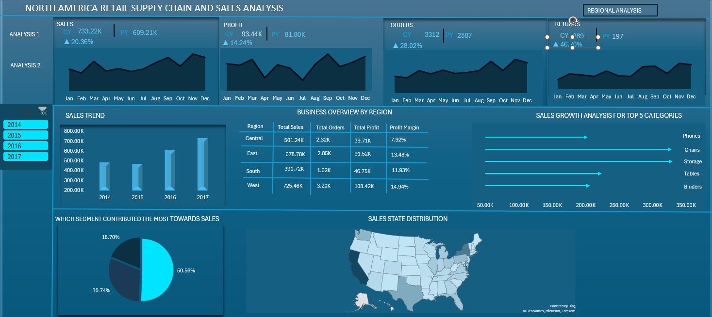
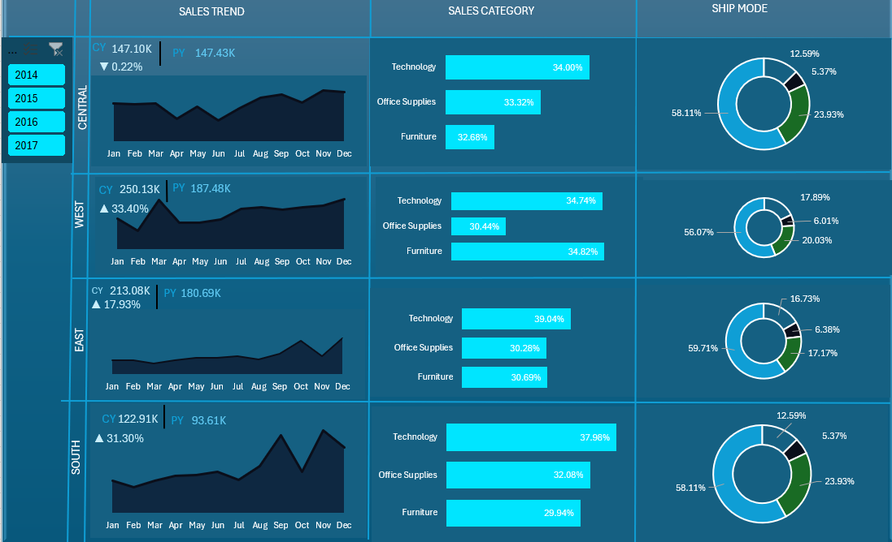
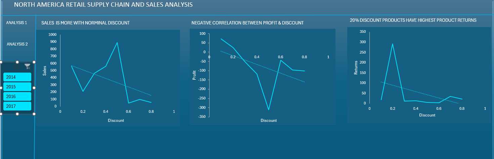
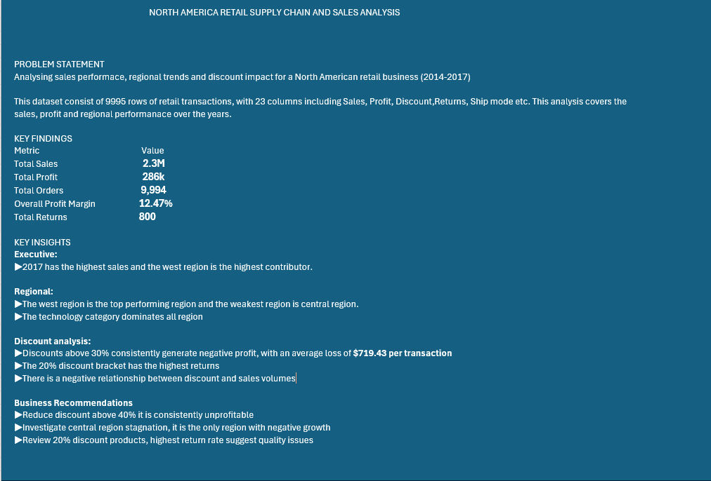

# North America Retail Supply Chain & Sales Analysis

## Overview
Analysis of 9,994 retail transactions across 4 regions 
covering 2014-2017.

## Tools Used
Excel · Power Query · PivotTables · PivotCharts

## Dashboard Pages
1. Executive Overview
2. Regional Analysis
3. Discount Analysis
4. Key Findings & Recommendations

## Key Findings
- 2017 highest sales year at 2.3M
- West region top performer at 33.42% YoY growth
- Discounts above 30% generate average loss of $719.43
- 20% discount bracket has highest return rate
- Central region only region with negative growth

## Screenshots

